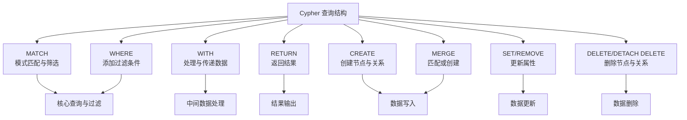

## ref
- https://chatgpt.com/c/695b95a2-01ec-8323-9dcb-4f18374396c9

## 概念
### 数据结构
- 标签（Label）：类似“表名”或“实体类型”
- 节点（Node）：类似“表中的一行”
- 关系（Relationship）：表示节点之间的连接
- 属性（Property）：节点或关系上的字段（类似表的列）

## 语法
- 它不使用 SQL，而是有自己专门的查询语言：Cypher（读作 “sai-fer”）。
- Cypher 是为图而设计的查询语言，语法直观且类 SQL。

### SQL vs Cypher 对照示例
| 功能       | SQL 写法                                          | Neo4j Cypher 写法                             |
| -------- | ----------------------------------------------- | ------------------------------------------- |
| 查询所有记录   | `SELECT * FROM Person;`                         | `MATCH (p:Person) RETURN p;`                |
| 条件查询     | `SELECT * FROM Person WHERE name='Alice';`      | `MATCH (p:Person {name:'Alice'}) RETURN p;` |
| 模糊查询     | `WHERE name LIKE 'A%'`                          | `WHERE p.name STARTS WITH 'A'`              |
| 计数       | `SELECT COUNT(*) FROM Person;`                  | `MATCH (p:Person) RETURN count(p);`         |
| 排序       | `ORDER BY age DESC`                             | `ORDER BY p.age DESC`                       |
| 限制条数     | `LIMIT 5`                                       | `LIMIT 5`                                   |
| 连接（JOIN） | `FROM Person p JOIN Movie m ON p.movie_id=m.id` | `MATCH (p:Person)-[:ACTED_IN]->(m:Movie)`   |

## Cypher 语法
- https://chatglm.cn/main/alltoolsdetail?lang=zh&cid=695e392bfc159c9685898834

### Cypher 查询结构
