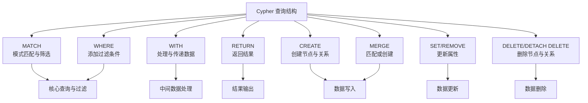

## ref
- https://chatgpt.com/c/695b95a2-01ec-8323-9dcb-4f18374396c9


## 概念
### 数据结构
- 标签（Label）：类似“表名”或“实体类型”
- 节点（Node）：类似“表中的一行”
- 关系（Relationship）：表示节点之间的连接
- 属性（Property）：节点或关系上的字段（类似表的列）


## 语法
- 它不使用 SQL，而是有自己专门的查询语言：Cypher（读作 “sai-fer”）。
- Cypher 是为图而设计的查询语言，语法直观且类 SQL。

### SQL vs Cypher 对照示例
| 功能       | SQL 写法                                          | Neo4j Cypher 写法                             |
| -------- | ----------------------------------------------- | ------------------------------------------- |
| 查询所有记录   | `SELECT * FROM Person;`                         | `MATCH (p:Person) RETURN p;`                |
| 条件查询     | `SELECT * FROM Person WHERE name='Alice';`      | `MATCH (p:Person {name:'Alice'}) RETURN p;` |
| 模糊查询     | `WHERE name LIKE 'A%'`                          | `WHERE p.name STARTS WITH 'A'`              |
| 计数       | `SELECT COUNT(*) FROM Person;`                  | `MATCH (p:Person) RETURN count(p);`         |
| 排序       | `ORDER BY age DESC`                             | `ORDER BY p.age DESC`                       |
| 限制条数     | `LIMIT 5`                                       | `LIMIT 5`                                   |
| 连接（JOIN） | `FROM Person p JOIN Movie m ON p.movie_id=m.id` | `MATCH (p:Person)-[:ACTED_IN]->(m:Movie)`   |


## Cypher 语法
- https://chatglm.cn/main/alltoolsdetail?cid=695e392bfc159c9685898834

### Cypher 查询结构
- https://chatglm.cn/main/alltoolsdetail?cid=695e392bfc159c9685898834


#### Cypher - 基本语法示例
- https://chatglm.cn/main/alltoolsdetail?cid=695e392bfc159c9685898834
```cypher
// 1. 清理现有数据（可选）
MATCH (n) DETACH DELETE n;

// 2. 创建公司节点
CREATE (:Company {name: 'TechCorp', industry: '科技'});

// 3. 创建人员节点
CREATE (:Person {id: 1, name: 'Alice', age: 29, city: '北京'});

// 4. 创建技能节点
CREATE (:Skill {name: 'Python'});

// 5. 创建人员与技能的关系
MATCH (p:Person {id: 1}), (s:Skill {name: 'Rust'}) 
CREATE (p)-[:HAS_SKILL {level: '中级'}]->(s);

// 6. 创建 WORKS_AT 关系
MATCH (p:Person {id: 1}), (c:Company {name: 'TechCorp'}) 
CREATE (p)-[:WORKS_AT {position: '工程师', since: '2023-09-01'}]->(c);

// 7. 创建 FRIEND 关系
// 添加相互的朋友关系（双向关系）
MATCH (a:Person {id: 1}), (b:Person {id: 19}) 
CREATE (a)-[:FRIEND {since: '2019-11-01'}]->(b), 
       (b)-[:FRIEND {since: '2019-11-01'}]->(a);

// 8. 创建索引和约束（提升查询性能）
CREATE INDEX person_name_idx IF NOT EXISTS FOR (p:Person) ON (p.name);

// 9. 唯一性约束
CREATE CONSTRAINT person_id_unique IF NOT EXISTS FOR (p:Person) REQUIRE p.id IS UNIQUE;
```

#### Neo4j Cypher - 删除
- https://chatglm.cn/main/alltoolsdetail?cid=695f389bada2f6762c425506
```cypher
// Neo4j 不允许删除还有关系的节点，
MERGE (p:Person {name: 'NewUser'})
DELETE p // 如果 p 有任何关系（进或出），操作会失败并报错。
;

// 安全删除
MERGE (p:Person {name: 'NewUser'})
DETACH DELETE p // 安全删除
;
```

#### Cypher - merge 新增或修改
- https://chatglm.cn/main/alltoolsdetail?cid=695f389bada2f6762c425506
- 相当于 MongoDB 的 Upsert 
```cypher
MERGE (p:Person {name: 'NewUser'})
  // 没有就创建
  ON CREATE SET p.age = 28, p.city = '北京', p.email = 'x@x.com'
  // 有就修改 (如追加字段)
  ON MATCH SET p.last_seen = timestamp(), p.version = 2
RETURN p
;
```

#### Cypher - match 和后面的 where 区别
- https://chatglm.cn/main/alltoolsdetail?cid=695f389bada2f6762c425506
- **`MATCH` 是“画图”，`WHERE` 是“擦图”**。
| 方面 | `MATCH` | `WHERE` |
| :-- | :-- | :-- |
| **核心职责** | **描述模式**：描述节点、关系以及它们如何连接。 | **过滤结果**：基于条件筛选出真正需要的行。 |
| **作用阶段** | **最先执行**：它是查询的起点，定义了图的遍历路径。 | **之后执行**：在 `MATCH` 找到数据后，再过滤这些数据。 |
| **能否省略** | **不能**（查询的起点）。 | **可以**（如果不需要过滤）。 |
| **书写位置** | 必须在 `WHERE` 之前。 | 必须在 `MATCH`（或 `WITH`/`START`）之后。 |
| **主要作用** | **定义路径**：如 `(a)-[:KNOWS]->(b)`。 | **定义条件**：如 `a.name = 'Alice'` 或 `b.age > 18`。 |

**简单总结**
*   **`MATCH`**: **“找路径”**。描述图的结构，是查询的骨架。
*   **`WHERE`**: **“加条件”**。

#### Cypher - 带 count 时，会自动聚合
```sql
MATCH (p:Person)
RETURN p.city, count(p)
;

-- SQL 写法对比
SELECT city, count(*)
FROM Person
GROUP BY city
```
- Cypher 会自动理解你的意图为：“请按 p.city 进行分组，然后计算每一组有多少个 p”。

#### Cypher - 关联查询与 SQL 比较
```sql
-- Cypher 关系查询
MATCH (p:Person)-[r:WORKS_AT]->(c:Company)
WHERE p.id = 1
RETURN p.name, c.name, r.position, r.since
;

-- 对应的 SQL 写法
SELECT 
    p.name, 
    c.name, 
    e.position, 
    e.since
FROM Persons p
JOIN Employments e ON p.id = e.person_id
JOIN Companies c ON e.company_name = c.name
;
```

#### Cypher - 创建关系与 SQL 比较
```sql
-- Cypher 绑定关系
MATCH (p:Person {id: 1}), (c:Company {name: 'TechCorp'}) 
CREATE (p)-[:WORKS_AT {position: '工程师', since: '2023-09-01'}]->(c)
;

-- 标准 SQL 写法 (使用 INSERT INTO ... SELECT)
INSERT INTO Employments (person_id, company_name, position, since)
SELECT 
    p.id,        -- 人员 ID
    c.name,      -- 公司名称 (假设是外键)
    '工程师',     -- 职位属性
    '2023-09-01' -- 入职时间属性
FROM Persons p, Companies c
WHERE p.id = 1            -- 对应 Cypher 的 (p:Person {id: 1})
  AND c.name = 'TechCorp' -- 对应 Cypher 的 (c:Company {name: 'TechCorp'})
;
```

#### Cypher - 查找共同兴趣的人员对 - 避免重复
```cypher
// 查询 6: 查找共同兴趣的人员对
MATCH (p1:Person)-[:HAS_INTEREST]->(i:Interest)<-[:HAS_INTEREST]-(p2:Person)
WHERE p1.name < p2.name  // 避免重复
WITH p1, p2, count(i) AS common_interests, collect(i.name) AS interest_names
WHERE common_interests >= 2
RETURN p1.name, p2.name, common_interests, interest_names
ORDER BY common_interests DESC
;

MATCH (p1:Person)-[:HAS_INTEREST]->(i:Interest)<-[:HAS_INTEREST]-(p2:Person)
WHERE p1.name < p2.name  // 避免重复
RETURN count(i) AS num   // 去重 269; 不去重 538 (注释掉上面的 where) 
;
```
- `p1.name < p2.name` 的作用是强制规定顺序，从而把成对的数据变成“有序对”，以此去除重复。
```js
组合 A：p1=Alice, p2=Bob (Alice 指向兴趣，Bob 指向兴趣)
组合 B：p1=Bob, p2=Alice (Bob 指向兴趣，Alice 指向兴趣)
结果：你会得到两行数据。
Alice | Bob | 2
Bob | Alice | 2

加上 p1.name < p2.name 后
只会得到一行数据。
Alice | Bob | 2
```

#### Cypher - 关系居中的写法
```cypher
// 查询 6: 查找共同兴趣的人员对
MATCH (p1:Person) - [:HAS_INTEREST] -> (i:Interest) <- [:HAS_INTEREST] - (p2:Person)
RETURN i LIMIT 10;
```
- 解读：这里的 `<-` 只是语法的变体，等价于 `(p2:Person)-[:HAS_INTEREST]->(i:Interest)`。
- 写成向左的箭头是为了让 i 居中，从而方便连接两个部分。

#### Cypher - 查看某节点所有的边
```cypher
// 列出该节点所有的入边（指向它的）和出边（它指出去的），以及连线的另一端的节点
MATCH (p:Person {name: 'NewUser'})-[r]-(other) // 查看所有的边
RETURN p, r, other
;
```
- `[r]`：不写关系类型和方向，表示匹配任何类型、任何方向的关系。
- `other`：代表连线另一端的节点。
```cypher
// 只看边（不关心另一端是谁）
MATCH (p:Person {name: 'Alice'})-[r]-(other)
RETURN r
;

// 只统计数量 (可用 `->` 统计出边)
MATCH (p:Person {name: 'Alice'})-[r]-(other)
RETURN type(r) AS `关系类型`, count(*) AS `数量`
;

// 只看出边（Alice 指向别人）
MATCH (p:Person {name: 'Alice'})-[r]->(other)
RETURN r, other
;

// 只看入边（别人指向 Alice）
// 下面的 `<-` 访问规则冲突 (access rule violation - invalid syntax)
//MATCH (p:Person {name: 'Alice'})-[r]<-(other)
//RETURN r, other;
MATCH (all_src)-[r]->(dst:Person {name: 'Alice'})
RETURN r
;

// 只返回边的属性列表
MATCH (p:Person {name: 'Alice'})-[r]-(other)
RETURN 
    type(r) AS `关系类型`, 
    properties(r) AS `关系属性`,
    other.name AS `对方名字`
;
```

#### Cypher - xx
```cypher
```

#### Cypher - xx
```cypher
```

#### Cypher - xx
```cypher
```