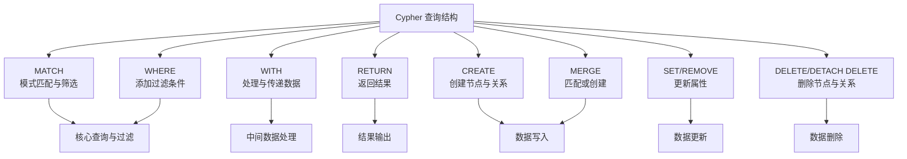

## ref
- https://chatgpt.com/c/695b95a2-01ec-8323-9dcb-4f18374396c9


## 概念
### 数据结构
- 标签（Label）：类似“表名”或“实体类型”
- 节点（Node）：类似“表中的一行”
- 关系（Relationship）：表示节点之间的连接
- 属性（Property）：节点或关系上的字段（类似表的列）


## 语法
- 它不使用 SQL，而是有自己专门的查询语言：Cypher（读作 “sai-fer”）。
- Cypher 是为图而设计的查询语言，语法直观且类 SQL。

### SQL vs Cypher 对照示例
| 功能       | SQL 写法                                          | Neo4j Cypher 写法                             |
| -------- | ----------------------------------------------- | ------------------------------------------- |
| 查询所有记录   | `SELECT * FROM Person;`                         | `MATCH (p:Person) RETURN p;`                |
| 条件查询     | `SELECT * FROM Person WHERE name='Alice';`      | `MATCH (p:Person {name:'Alice'}) RETURN p;` |
| 模糊查询     | `WHERE name LIKE 'A%'`                          | `WHERE p.name STARTS WITH 'A'`              |
| 计数       | `SELECT COUNT(*) FROM Person;`                  | `MATCH (p:Person) RETURN count(p);`         |
| 排序       | `ORDER BY age DESC`                             | `ORDER BY p.age DESC`                       |
| 限制条数     | `LIMIT 5`                                       | `LIMIT 5`                                   |
| 连接（JOIN） | `FROM Person p JOIN Movie m ON p.movie_id=m.id` | `MATCH (p:Person)-[:ACTED_IN]->(m:Movie)`   |


## Cypher 语法
- https://chatglm.cn/main/alltoolsdetail?cid=695e392bfc159c9685898834

### Cypher 查询结构
- https://chatglm.cn/main/alltoolsdetail?cid=695e392bfc159c9685898834


#### Cypher - 基本语法示例
- https://chatglm.cn/main/alltoolsdetail?cid=695e392bfc159c9685898834
```cypher
// 1. 清理现有数据（可选）
MATCH (n) DETACH DELETE n;

// 2. 创建公司节点
CREATE (:Company {name: 'TechCorp', industry: '科技'});

// 3. 创建人员节点
CREATE (:Person {id: 1, name: 'Alice', age: 29, city: '北京'});

// 4. 创建技能节点
CREATE (:Skill {name: 'Python'});

// 5. 创建人员与技能的关系
MATCH (p:Person {id: 1}), (s:Skill {name: 'Rust'}) 
CREATE (p)-[:HAS_SKILL {level: '中级'}]->(s);

// 6. 创建 WORKS_AT 关系
MATCH (p:Person {id: 1}), (c:Company {name: 'TechCorp'}) 
CREATE (p)-[:WORKS_AT {position: '工程师', since: '2023-09-01'}]->(c);

// 7. 创建 FRIEND 关系
// 添加相互的朋友关系（双向关系）
MATCH (a:Person {id: 1}), (b:Person {id: 19}) 
CREATE (a)-[:FRIEND {since: '2019-11-01'}]->(b), 
       (b)-[:FRIEND {since: '2019-11-01'}]->(a);

// 8. 创建索引和约束（提升查询性能）
CREATE INDEX person_name_idx IF NOT EXISTS FOR (p:Person) ON (p.name);

// 9. 唯一性约束
CREATE CONSTRAINT person_id_unique IF NOT EXISTS FOR (p:Person) REQUIRE p.id IS UNIQUE;
```

#### Neo4j Cypher - 删除
- https://chatglm.cn/main/alltoolsdetail?cid=695f389bada2f6762c425506
```cypher
// Neo4j 不允许删除还有关系的节点，
MERGE (p:Person {name: 'NewUser'})
DELETE p // 如果 p 有任何关系（进或出），操作会失败并报错。
;

// 安全删除
MERGE (p:Person {name: 'NewUser'})
DETACH DELETE p // 安全删除
;
```

#### Cypher - merge 新增或修改
- https://chatglm.cn/main/alltoolsdetail?cid=695f389bada2f6762c425506
- 相当于 MongoDB 的 Upsert 
```cypher
MERGE (p:Person {name: 'NewUser'})
  // 没有就创建
  ON CREATE SET p.age = 28, p.city = '北京', p.email = 'x@x.com'
  // 有就修改 (如追加字段)
  ON MATCH SET p.last_seen = timestamp(), p.version = 2
RETURN p
;
```

#### Cypher - match 和后面的 where 区别
- https://chatglm.cn/main/alltoolsdetail?cid=695f389bada2f6762c425506
- **`MATCH` 是“画图”，`WHERE` 是“擦图”**。
| 方面 | `MATCH` | `WHERE` |
| :-- | :-- | :-- |
| **核心职责** | **描述模式**：描述节点、关系以及它们如何连接。 | **过滤结果**：基于条件筛选出真正需要的行。 |
| **作用阶段** | **最先执行**：它是查询的起点，定义了图的遍历路径。 | **之后执行**：在 `MATCH` 找到数据后，再过滤这些数据。 |
| **能否省略** | **不能**（查询的起点）。 | **可以**（如果不需要过滤）。 |
| **书写位置** | 必须在 `WHERE` 之前。 | 必须在 `MATCH`（或 `WITH`/`START`）之后。 |
| **主要作用** | **定义路径**：如 `(a)-[:KNOWS]->(b)`。 | **定义条件**：如 `a.name = 'Alice'` 或 `b.age > 18`。 |

**简单总结**
*   **`MATCH`**: **“找路径”**。描述图的结构，是查询的骨架。
*   **`WHERE`**: **“加条件”**。

#### Cypher - 带 count 时，会自动聚合
```sql
MATCH (p:Person)
RETURN p.city, count(p)
;

-- SQL 写法对比
SELECT city, count(*)
FROM Person
GROUP BY city
```
- Cypher 会自动理解你的意图为：“请按 p.city 进行分组，然后计算每一组有多少个 p”。

#### Cypher - 关联查询与 SQL 比较
```sql
-- Cypher 关系查询
MATCH (p:Person)-[r:WORKS_AT]->(c:Company)
WHERE p.id = 1
RETURN p.name, c.name, r.position, r.since
;

-- 对应的 SQL 写法
SELECT 
    p.name, 
    c.name, 
    e.position, 
    e.since
FROM Persons p
JOIN Employments e ON p.id = e.person_id
JOIN Companies c ON e.company_name = c.name
;
```

#### Cypher - 创建关系与 SQL 比较
```sql
-- Cypher 绑定关系
MATCH (p:Person {id: 1}), (c:Company {name: 'TechCorp'}) 
CREATE (p)-[:WORKS_AT {position: '工程师', since: '2023-09-01'}]->(c)
;

-- 标准 SQL 写法 (使用 INSERT INTO ... SELECT)
INSERT INTO Employments (person_id, company_name, position, since)
SELECT 
    p.id,        -- 人员 ID
    c.name,      -- 公司名称 (假设是外键)
    '工程师',     -- 职位属性
    '2023-09-01' -- 入职时间属性
FROM Persons p, Companies c
WHERE p.id = 1            -- 对应 Cypher 的 (p:Person {id: 1})
  AND c.name = 'TechCorp' -- 对应 Cypher 的 (c:Company {name: 'TechCorp'})
;
```

#### Cypher - 查找共同兴趣的人员对 - 避免重复
```cypher
// 查询 6: 查找共同兴趣的人员对
MATCH (p1:Person)-[:HAS_INTEREST]->(i:Interest)<-[:HAS_INTEREST]-(p2:Person)
WHERE p1.name < p2.name  // 避免重复
WITH p1, p2, count(i) AS common_interests, collect(i.name) AS interest_names
WHERE common_interests >= 2
RETURN p1.name, p2.name, common_interests, interest_names
ORDER BY common_interests DESC
;

MATCH (p1:Person)-[:HAS_INTEREST]->(i:Interest)<-[:HAS_INTEREST]-(p2:Person)
WHERE p1.name < p2.name  // 避免重复
RETURN count(i) AS num   // 去重 269; 不去重 538 (注释掉上面的 where) 
;
```
- `p1.name < p2.name` 的作用是强制规定顺序，从而把成对的数据变成“有序对”，以此去除重复。
```js
组合 A：p1=Alice, p2=Bob (Alice 指向兴趣，Bob 指向兴趣)
组合 B：p1=Bob, p2=Alice (Bob 指向兴趣，Alice 指向兴趣)
结果：你会得到两行数据。
Alice | Bob | 2
Bob | Alice | 2

加上 p1.name < p2.name 后
只会得到一行数据。
Alice | Bob | 2
```

#### Cypher - 关系居中的写法
```cypher
// 查询 6: 查找共同兴趣的人员对
MATCH (p1:Person) - [:HAS_INTEREST] -> (i:Interest) <- [:HAS_INTEREST] - (p2:Person)
RETURN i LIMIT 10;
```
- 解读：这里的 `<-` 只是语法的变体，等价于 `(p2:Person)-[:HAS_INTEREST]->(i:Interest)`。
- 写成向左的箭头是为了让 i 居中，从而方便连接两个部分。

#### Cypher - 查看某节点所有的边
```cypher
// 列出该节点所有的入边（指向它的）和出边（它指出去的），以及连线的另一端的节点
MATCH (p:Person {name: 'NewUser'})-[r]-(other) // 查看所有的边
RETURN p, r, other
;
```
- `[r]`：不写关系类型和方向，表示匹配任何类型、任何方向的关系。
- `other`：代表连线另一端的节点。
```cypher
// 只看边（不关心另一端是谁）
MATCH (p:Person {name: 'Alice'})-[r]-(other)
RETURN r
;

// 只统计数量 (可用 `->` 统计出边)
MATCH (p:Person {name: 'Alice'})-[r]-(other)
RETURN type(r) AS `关系类型`, count(*) AS `数量`
;

// 只看出边（Alice 指向别人）
MATCH (p:Person {name: 'Alice'})-[r]->(other)
RETURN r, other
;

// 只看入边（别人指向 Alice）
// 下面的 `<-` 访问规则冲突 (access rule violation - invalid syntax)
//MATCH (p:Person {name: 'Alice'})-[r]<-(other)
//RETURN r, other;
MATCH (all_src)-[r]->(dst:Person {name: 'Alice'})
RETURN r
;

// 只返回边的属性列表
MATCH (p:Person {name: 'Alice'})-[r]-(other)
RETURN 
    type(r) AS `关系类型`, 
    properties(r) AS `关系属性`,
    other.name AS `对方名字`
;
```

#### Cypher - with 语法 & 基础示例
- https://chatglm.cn/main/alltoolsdetail?cid=6960dbad8d9878b41be1768a
- WITH 子句在 Cypher 查询中主要扮演两个核心角色：
- **数据流水线 (Piping Results)**：它**将前一个查询阶段的结果传递给下一个阶段**，就像管道一样连接不同的查询操作。这**允许你将一个复杂查询拆解为多个逻辑步骤**，使代码更清晰、更易于理解和维护。
- **中间数据处理与转换**：在传递结果之前，你可以使用 WITH **对结果集进行各种操作，例如过滤、排序、聚合、计算新变量、限制结果数量等**。这意味着你**不必一次性处理所有数据**，而是在每个阶段只关注和操作所需的数据 。
- **基本语法**
```sql
WITH [expressions] [AS alias]
    [WHERE conditions] 
    [ORDER BY ...]
    [SKIP ...] [LIMIT ...]
```
- **基础示例**
```cypher
// 查找所有 Person 节点，按年龄降序排列，取前 5 人，返回姓名和年龄
MATCH (p:Person)
WITH p // 传递变量
  WHERE p.age > 30 // 过滤数据
  ORDER BY p.age DESC // 排序
  LIMIT 5 // 限制 5 条
RETURN p.name, p.age
;
```

#### Cypher - with 聚合数据
- (COUNT, SUM, COLLECT 等)
```cypher
// 计算每个人拥有的技能数量
MATCH (p:Person)-[:HAS_SKILL]->(s:Skill)
WITH p, COUNT(s) AS skill_count // 聚合统计
RETURN p.name, skill_count
;
```

#### Cypher - with 多次使用 (分步骤处理)
```cypher
// 1. 找出技能数至少 3 个的人
// 2. 从这些人中，再筛选出年龄大于 35 岁的人
// 3. 返回他们的姓名和参演电影数
MATCH (p:Person)-[:HAS_SKILL]->(s:Skill)
WITH p, COUNT(s) AS skill_count
  WHERE skill_count >= 3
WITH p, skill_count
  WHERE p.age > 35
RETURN p.name, skill_count
;
```

#### Cypher - with 过滤后再匹配 & 设置
```cypher
// 1. 找出年龄大于 45 岁的人
// 2. 然后找出这些人中认识的所有朋友
// 3. 返回这个人和他朋友的名字
MATCH (p:Person)
WITH p
  WHERE p.age > 45
MATCH (p)- [:FRIEND] - >(f:Person)
RETURN p.name, p.age, f.name
;

// 为年龄大于 50 岁的人创建一个“VIP”标签
MATCH (p:Person)
WITH p
  WHERE p.age > 50
SET p:VIP
RETURN p.name
;
```

#### Cypher - remove 与 set 使用
- https://chatglm.cn/main/alltoolsdetail?cid=6960dbad8d9878b41be1768a
```cypher
// 创建测试数据
MERGE (p:Person {name: 'Tom Hanks'})
ON CREATE SET p.age = 28, p.city = '北京' // 没有就创建
RETURN p;

// set 测试
MATCH (p:Person {name: 'Tom Hanks'}) SET p.age = 66;
MATCH (p:Person {name: 'Tom Hanks'}) SET p.age = 66, p.nationality = 'American';
MATCH (p:Person {name: 'Tom Hanks'}) SET p += {height: 183, profession: 'Actor'};
MATCH (p:Person {name: 'Tom Hanks'}) SET p = {name: 'Tom Hanks', age: 66};
MATCH (p:Person {name: 'Tom Hanks'}) SET p:Actor;

// remove 测试
MATCH (p:Person {name: 'Tom Hanks'}) REMOVE p.age;
MATCH (p:Person {name: 'Tom Hanks'}) REMOVE p.age, p.nationality;
MATCH (p:Person {name: 'Tom Hanks'}) REMOVE p:Actor;

MERGE (p:Person {name: 'Tom Hanks'}) RETURN p;
MATCH (p:Person) WHERE p.nationality IS NULL RETURN p;
```
1. **SET 子句的用法与示例**
- `SET` 非常灵活，既可以直接赋值，也可以用 `+=` 操作符合并更新。

| 操作场景 | 语法 | 示例 | 说明 |
| :-- | :-- | :-- | :-- |
| **设置/更新节点属性** | `SET node.property = value` | `MATCH (p:Person {name: 'Tom Hanks'}) SET p.age = 66` | 将匹配到的节点的 `age` 属性更新为 `66`。 |
| **同时设置多个属性** | `SET node.prop1 = val1, node.prop2 = val2` | `MATCH (p:Person {name: 'Tom Hanks'}) SET p.age = 66, p.nationality = 'American'` | 一次性更新 `age` 和 `nationality` 两个属性。 |
| **合并更新 (+=)** | `SET node += {prop1: val1, prop2: val2}` | `MATCH (p:Person {name: 'Tom Hanks'}) SET p += {height: 183, profession: 'Actor'}` | **只会更新** `height` 和 `profession`，**不会影响**节点已有的其他属性（如 `name`, `age`）。这是**更新**而非**替换**【turn0search8】【turn0search11】。 |
| **直接替换所有属性** | `SET node = {prop1: val1, prop2: val2}` | `MATCH (p:Person {name: 'Tom Hanks'}) SET p = {name: 'Tom Hanks', age: 66}` | **会覆盖**节点原有的所有属性，只保留 `name` 和 `age`。原有其他属性（如 `nationality`）会被**全部删除**【turn0search5】【turn0search11】。 |
| **添加节点标签** | `SET node:Label` | `MATCH (p:Person {name: 'Tom Hanks'}) SET p:Actor` | 给匹配到的节点添加 `Actor` 标签。节点可以拥有多个标签。 |
| **设置关系属性** | `SET relationship.property = value` | `MATCH (:Person {name: 'Tom Hanks'})-[r:ACTED_IN]->(:Movie {title: 'Forrest Gump'}) SET r.award = 'Best Actor'` | 为关系添加 `award` 属性。 |

2. **REMOVE 子句的用法与示例**
- `REMOVE` 专注于清理，可以精准移除属性或标签。

| 操作场景 | 语法 | 示例 | 说明 |
| :-- | :-- | :-- | :-- |
| **删除节点属性** | `REMOVE node.property` | `MATCH (p:Person {name: 'Tom Hanks'}) REMOVE p.age` | 从匹配到的节点中删除 `age` 属性。 |
| **删除多个属性** | `REMOVE node.prop1, node.prop2` | `MATCH (p:Person {name: 'Tom Hanks'}) REMOVE p.age, p.nationality` | 一次性删除 `age` 和 `nationality` 两个属性。 |
| **删除节点标签** | `REMOVE node:Label` | `MATCH (p:Person {name: 'Tom Hanks'}) REMOVE p:Actor` | 从匹配到的节点中移除 `Actor` 标签。 |
| **删除关系的属性** | `REMOVE relationship.property` | `MATCH (a:Person {name: 'Alice'})-[r:KNOWS]->(b:Person {name: 'Bob'}) REMOVE r.since` | 删除 `KNOWS` 关系上的 `since` 属性。 |

#### Cypher - match 语法 🔍
- https://chatglm.cn/main/alltoolsdetail?lang=zh&cid=696462129cf93d77b9c35c10
- 查询模式：
*   **节点 (Nodes)**：用小括号 `()` 表示，代表实体（如人、公司）。
*   **关系 (Relationships)**：用中括号 `[]` 表示，代表节点之间的连接（如 `KNOWS`, `WORKS_AT`）。
*   **路径 (Paths)**：由节点和关系组成的序列。
- **基础语法与元素**
```cypher
MATCH (a:Label1)-[r:RELATIONSHIP]->(b:Label2)
WHERE condition1 AND condition2
RETURN a, b, r
```
1.  **匹配带有特定属性的节点**
    ```cypher
    MATCH (person:Person {name: 'Keanu Reeves'}) RETURN person
    ```
    这会精确匹配名为 'Keanu Reeves' 的 `Person` 节点。
2.  **匹配节点及其关系**
    ```cypher
    MATCH (p:Person)-[r:ACTED_IN]->(m:Movie) RETURN p.name, m.title, r.role
    ```
    这会找出所有参演了电影的演员，并返回演员名、电影名和角色名。

#### Cypher - match 可变长度关系（路径） 🔄
- https://chatglm.cn/main/alltoolsdetail?lang=zh&cid=696462129cf93d77b9c35c10
- **不需要知道确切的关系数量，可以匹配一个范围内的跳数**。
```cypher
// 查找 Alice 和 Bob 之间 1 到 3 层认识的关系
MATCH (a:Person {name: 'Alice'})-[f:FRIEND*1..3]->(b:Person {name: 'Bob'}) RETURN a, f, b;
// 最大 2 层关系
MATCH (a:Person {name: 'Alice'})-[f:FRIEND*..2]->(b:Person {name: 'Bob'}) RETURN a, f, b;
// 固定长度关系
MATCH (a:Person {name: 'Alice'})-[f:FRIEND*2]->(b:Person {name: 'Bob'}) RETURN a, f, b;
// 查找所有与 Alice 认识的人（不限跳数）
// `*` 此语法会数据爆炸 (产生大量结果，非死循环)
MATCH (a:Person {name: 'Alice'})-[:FRIEND*]->(friend) RETURN friend;
// `*M..` 此语法会数据爆炸 (产生大量结果，非死循环)
// MATCH (a:Person {name: 'Alice'})-[f:FRIEND*2..]->(b:Person {name: 'Bob'}) RETURN a, f, b;
```
*   `*` 后面可以跟 `..N`（最大`N`跳）、`M..`（至少`M`跳）、`M..N`（`M`到`N`跳）。

#### Cypher - match 路径变量 🛣️
- https://chatglm.cn/main/alltoolsdetail?lang=zh&cid=696462129cf93d77b9c35c10
- 可以将匹配到的整个路径赋值给一个变量，然后返回它
```cypher
MATCH sp = shortestPath((a:Person {name: 'Alice'})-[*]-(b:Person {name: 'Bob'}))
RETURN sp;

MATCH asp = allShortestPaths((a:Person {name: 'Alice'})-[:FRIEND*]->(b:Person {name: 'Bob'}))
RETURN asp;
```
- `shortestPath()` 函数**会自动计算最短路径**
- `allShortestPaths()` 函数**返回所有等长的最短路径**。

#### Cypher - match 无方向关系
- https://chatglm.cn/main/alltoolsdetail?lang=zh&cid=69646a067cc83323da1762b0
- 在模式中使用 `- -` 代替 `- ->` 或 `<- -` 可以匹配任一方向的关系。
```cypher
// 查找“Bob”的所有“FRIEND”关系，不区分方向
MATCH (a:Person {name: 'Bob'})-[r:FRIEND]-(person)
RETURN r, person;
```

#### Cypher - match 综合示例与最佳实践
- https://chatglm.cn/main/alltoolsdetail?lang=zh&cid=69646a067cc83323da1762b0
- 假设我们有一个社交网络图：`(:Person)-[:FRIEND]->(:Person)`。我们想：
  - 找出“David”的朋友的朋友（2 跳）。
  - 过滤出这些“朋友的朋友”的粉丝数大于 10 的。
  - 返回这些用户及其到“David”的路径。
```cypher
// 1. 找出“David”的朋友的朋友（2跳）
MATCH (david:Person {name: 'David'})-[:FRIEND*2]-(friendOfFriend)

// 2. 统计这些用户的粉丝数并过滤
OPTIONAL MATCH (follower:Person)-[:FRIEND]->(friendOfFriend)
WITH friendOfFriend, count(follower) AS followerCount
WHERE followerCount > 10

// 3. 返回用户信息及其到“David”的路径
OPTIONAL MATCH p = (david)-[:FRIEND*1..2]->(friendOfFriend)
RETURN 
  friendOfFriend.name, 
  followerCount, 
  [n IN nodes(p) | n.name] AS pathNames
ORDER BY followerCount DESC;

// 第 3 部分详解
// ① OPTIONAL MATCH p = (...)
//   这里定义了一个变量 p，表示一条路径（Path）。
//   匹配结果是一条 路径对象，存进 p。
//     类比 SQL：p = (...) 就像 JOIN 时把整条路径保存为一个“列”，里面包含所有节点和关系。
// ② nodes(p)
//   nodes(p) 是 Cypher 的内置函数，返回路径中所有节点的列表。
//   例如，如果 p 是路径：
//     (David)-[:FRIEND]->(Alice)-[:FRIEND]->(Bob)
//   那 nodes(p) 就是：
//     [David, Alice, Bob]
// ③ [n IN nodes(p) | n.name]
//   这是 列表推导式 (List Comprehension)，语法类似 Python：
//     [变量 IN 列表 | 映射表达式]
//   意思是：
//     遍历 nodes(p) 这个节点列表；
//     对每个节点 n，取出它的 name 属性；
//     最终返回一个名字数组。
//   例子：
//     ["David", "Alice", "Bob"]
```

#### Cypher - optional match 说明及示例
- `OPTIONAL MATCH` 类似于 SQL 里的 `LEFT JOIN`，未匹配到的部分为 `NULL`
- `MATCH` 类似于 SQL 里的 `INNER JOIN`，未匹配到的部分不返回
```cypher
MATCH (p:Person)
  OPTIONAL MATCH (p:Person)-[:HAS_SKILL]->(skill:Skill)
RETURN p.name, collect(skill.name) AS skills;
```

#### Cypher - match 和 merge 的区别
- https://chatglm.cn/main/alltoolsdetail?lang=zh&cid=696462129cf93d77b9c35c10
- 它们是 Cypher 中用于操作图数据的**两个基础但用途不同的子句**
- **核心概念对比**

| 特性 | MATCH | MERGE |
| :-- | :-- | :-- |
| **核心功能** | **仅匹配**现有图中的模式 | **匹配或创建**模式（"确保存在"） |
| **行为模式** | 如果模式不存在，**不返回任何结果** | 如果模式不存在，**创建新节点/关系** |
| **重复执行** | 每次执行都尝试匹配 | **幂等操作**：重复执行多次效果与执行一次相同（不会创建重复数据） |
| **类似概念** | SQL 中的 `SELECT` | SQL 中的 `INSERT ... ON DUPLICATE KEY UPDATE` 或 `UPSERT` |
| **主要用途** | 查询、检索数据 | **数据同步、初始化、确保数据唯一存在** |

```cypher
// 都可用于查找返回
MERGE (p:Person {name: 'Tom Hanks'}) RETURN p; // merge -> return
MATCH (p:Person {name: 'Tom Hanks'}) RETURN p;
```